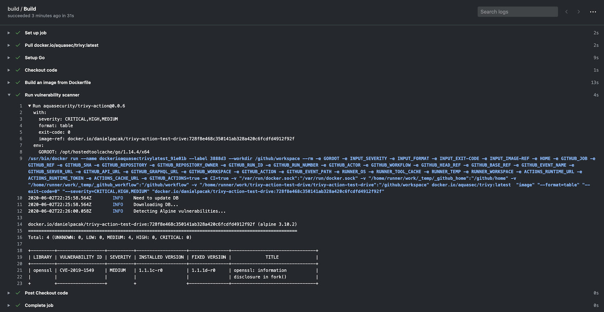

# Trivy Action

> [GitHub Action](https://github.com/features/actions) for [Trivy](https://github.com/aquasecurity/trivy)

[![GitHub Release][release-img]][release]
[![GitHub Marketplace][marketplace-img]][marketplace]
[![License][license-img]][license]



## Table of Contents

* [Usage](#usage)
  * [Scan CI Pipeline](#scan-ci-pipeline)
  * [Scan CI Pipeline (w/ Trivy Config)](#scan-ci-pipeline-w-trivy-config)
  * [Cache](#cache)
  * [Trivy Setup](#trivy-setup)
  * [Scanning a Tarball](#scanning-a-tarball)
  * [Using Trivy with templates](#using-trivy-with-templates)
  * [Using Trivy with GitHub Code Scanning](#using-trivy-with-github-code-scanning)
  * [Using Trivy to scan your Git repo](#using-trivy-to-scan-your-git-repo)
  * [Using Trivy to scan your rootfs directories](#using-trivy-to-scan-your-rootfs-directories)
  * [Using Trivy to scan Infrastructure as Code](#using-trivy-to-scan-infrastructure-as-code)
  * [Using Trivy to generate SBOM](#using-trivy-to-generate-sbom)
  * [Using Trivy to scan your private registry](#using-trivy-to-scan-your-private-registry)
  * [Using Trivy if you don't have code scanning enabled](#using-trivy-if-you-dont-have-code-scanning-enabled)
* [Customizing](#customizing)
  * [inputs](#inputs)
  * [Environment variables](#environment-variables)
  * [Trivy config file](#trivy-config-file)

## Usage

### Scan CI Pipeline

```yaml
name: build
on:
  push:
    branches:
      - main
  pull_request:
jobs:
  build:
    name: Build
    runs-on: ubuntu-20.04
    steps:
      - name: Checkout code
        uses: actions/checkout@v3
      - name: Build an image from Dockerfile
        run: docker build -t docker.io/my-organization/my-app:${{ github.sha }} .
      - name: Run Trivy vulnerability scanner
        uses: aquasecurity/trivy-action@0.28.0
        with:
          image-ref: 'docker.io/my-organization/my-app:${{ github.sha }}'
          format: 'table'
          exit-code: '1'
          ignore-unfixed: true
          vuln-type: 'os,library'
          severity: 'CRITICAL,HIGH'
```

### Scan CI Pipeline (w/ Trivy Config)

```yaml
name: build
on:
  push:
    branches:
    - main
  pull_request:
jobs:
  build:
    name: Build
    runs-on: ubuntu-20.04
    steps:
    - name: Checkout code
      uses: actions/checkout@v4

    - name: Run Trivy vulnerability scanner in fs mode
      uses: aquasecurity/trivy-action@0.28.0
      with:
        scan-type: 'fs'
        scan-ref: '.'
        trivy-config: trivy.yaml
```

In this case `trivy.yaml` is a YAML configuration that is checked in as part of the repo. Detailed information is available on the Trivy website but an example is as follows:
```yaml
format: json
exit-code: 1
severity: CRITICAL
secret:
  config: config/trivy/secret.yaml
```

It is possible to define all options in the `trivy.yaml` file. Specifying individual options via the action are left for backward compatibility purposes. Defining the following is required as they cannot be defined with the config file:
- `scan-ref`: If using `fs, repo` scans.
- `image-ref`: If using `image` scan.
- `scan-type`: To define the scan type, e.g. `image`, `fs`, `repo`, etc.

#### Order of preference for options
Trivy uses [Viper](https://github.com/spf13/viper) which has a defined precedence order for options. The order is as follows:
- GitHub Action flag
- Environment variable
- Config file
- Default

### Cache
The action has a built-in functionality for caching and restoring [the vulnerability DB](https://github.com/aquasecurity/trivy-db), [the Java DB](https://github.com/aquasecurity/trivy-java-db) and [the checks bundle](https://github.com/aquasecurity/trivy-checks) if they are downloaded during the scan.
The cache is stored in the `$GITHUB_WORKSPACE/.cache/trivy` directory by default.
The cache is restored before the scan starts and saved after the scan finishes.

It uses [actions/cache](https://github.com/actions/cache) under the hood but requires less configuration settings.
The cache input is optional, and caching is turned on by default.

#### Disabling caching
If you want to disable caching, set the `cache` input to `false`, but we recommend keeping it enabled to avoid rate limiting issues.

```yaml
    - name: Run Trivy scanner without cache
      uses: aquasecurity/trivy-action@0.28.0
      with:
        scan-type: 'fs'
        scan-ref: '.'
        cache: 'false'
```

#### Updating caches in the default branch
Please note that there are [restrictions on cache access](https://docs.github.com/en/actions/writing-workflows/choosing-what-your-workflow-does/caching-dependencies-to-speed-up-workflows#restrictions-for-accessing-a-cache) between branches in GitHub Actions.
By default, a workflow can access and restore a cache created in either the current branch or the default branch (usually `main` or `master`).
If you need to share caches across branches, you may need to create a cache in the default branch and restore it in the current branch.

To optimize your workflow, you can set up a cron job to regularly update the cache in the default branch.
This allows subsequent scans to use the cached DB without downloading it again.

```yaml
# Note: This workflow only updates the cache. You should create a separate workflow for your actual Trivy scans.
# In your scan workflow, set TRIVY_SKIP_DB_UPDATE=true and TRIVY_SKIP_JAVA_DB_UPDATE=true.
name: Update Trivy Cache

on:
  schedule:
    - cron: '0 0 * * *'  # Run daily at midnight UTC
  workflow_dispatch:  # Allow manual triggering

jobs:
  update-trivy-db:
    runs-on: ubuntu-latest
    steps:
      - name: Setup oras
        uses: oras-project/setup-oras@v1

      - name: Get current date
        id: date
        run: echo "date=$(date +'%Y-%m-%d')" >> $GITHUB_OUTPUT

      - name: Download and extract the vulnerability DB
        run: |
          mkdir -p $GITHUB_WORKSPACE/.cache/trivy/db
          oras pull ghcr.io/aquasecurity/trivy-db:2
          tar -xzf db.tar.gz -C $GITHUB_WORKSPACE/.cache/trivy/db
          rm db.tar.gz

      - name: Download and extract the Java DB
        run: |
          mkdir -p $GITHUB_WORKSPACE/.cache/trivy/java-db
          oras pull ghcr.io/aquasecurity/trivy-java-db:1
          tar -xzf javadb.tar.gz -C $GITHUB_WORKSPACE/.cache/trivy/java-db
          rm javadb.tar.gz

      - name: Cache DBs
        uses: actions/cache/save@v4
        with:
          path: ${{ github.workspace }}/.cache/trivy
          key: cache-trivy-${{ steps.date.outputs.date }}
```

When running a scan, set the environment variables `TRIVY_SKIP_DB_UPDATE` and `TRIVY_SKIP_JAVA_DB_UPDATE` to skip the download process.

```yaml
    - name: Run Trivy scanner without downloading DBs
      uses: aquasecurity/trivy-action@0.28.0
      with:
        scan-type: 'image'
        scan-ref: 'myimage'
      env:
        TRIVY_SKIP_DB_UPDATE: true
        TRIVY_SKIP_JAVA_DB_UPDATE: true
```

### Trivy Setup
By default the action calls [`aquasecurity/setup-trivy`](https://github.com/aquasecurity/setup-trivy) as the first step
which installs the `trivy` version specified by the `version` input.  If you have already installed `trivy` by other
means, e.g. calling `aquasecurity/setup-trivy` directly, or are invoking this action multiple times then you can use the
`skip-setup-trivy` input to disable this step.

#### Setting up Trivy Manually
```yaml
name: build
on:
  push:
    branches:
    - main
  pull_request:
jobs:
  build:
    name: Build
    runs-on: ubuntu-20.04
    steps:
    - name: Checkout code
      uses: actions/checkout@v4

    - name: Manual Trivy Setup
      uses: aquasecurity/setup-trivy@v0.2.0
      with:
        cache: true
        version: v0.57.1

    - name: Run Trivy vulnerability scanner in repo mode
      uses: aquasecurity/trivy-action@master
      with:
        scan-type: 'fs'
        ignore-unfixed: true
        format: 'sarif'
        output: 'trivy-results.sarif'
        severity: 'CRITICAL'
        skip-setup-trivy: true
```

#### Skipping Setup when Calling Trivy Action multiple times
Another common use case is when a build calls this action multiple times, in this case we can set `skip-setup-trivy` to 
`true` on subsequent invocations e.g.

```yaml
name: build

on:
  push:
    branches:
      - main
  pull_request:

jobs:
  test:
    runs-on: ubuntu-latest
    permissions:
      contents: read
    steps:
      - name: Check out Git repository
        uses: actions/checkout@v4

      # The first call to the action will invoke setup-trivy and install trivy
      - name: Generate Trivy Vulnerability Report
        uses: aquasecurity/trivy-action@master
        with:
          scan-type: "fs"
          output: trivy-report.json
          format: json
          scan-ref: .
          exit-code: 0

      - name: Upload Vulnerability Scan Results
        uses: actions/upload-artifact@v4
        with:
          name: trivy-report
          path: trivy-report.json
          retention-days: 30

      - name: Fail build on High/Criticial Vulnerabilities
        uses: aquasecurity/trivy-action@master
        with:
          scan-type: "fs"
          format: table
          scan-ref: .
          severity: HIGH,CRITICAL
          ignore-unfixed: true
          exit-code: 1
          # On a subsequent call to the action we know trivy is already installed so can skip this
          skip-setup-trivy: true
```

#### Use non-default token to install Trivy
GitHub Enterprise Server (GHES) uses an invalid `github.token` for `https://github.com` server.
Therefore, you can't install `Trivy` using the `setup-trivy` action.

To fix this problem, you need to overwrite the token for `setup-trivy` using `token-setup-trivy` input:
```yaml
    - name: Run Trivy scanner without cache
      uses: aquasecurity/trivy-action@0.28.0
      with:
        scan-type: 'fs'
        scan-ref: '.'
        token-setup-trivy: ${{ secrets.GITHUB_PAT }}
```

GitHub even has [create-github-app-token](https://github.com/actions/create-github-app-token) for similar cases.

### Scanning a Tarball
```yaml
name: build
on:
  push:
    branches:
    - main
  pull_request:
jobs:
  build:
    name: Build
    runs-on: ubuntu-20.04
    steps:
    - name: Checkout code
      uses: actions/checkout@v4

    - name: Generate tarball from image
      run: |
        docker pull <your-docker-image>
        docker save -o vuln-image.tar <your-docker-image>

    - name: Run Trivy vulnerability scanner in tarball mode
      uses: aquasecurity/trivy-action@0.28.0
      with:
        input: /github/workspace/vuln-image.tar
        severity: 'CRITICAL,HIGH'
```

### Using Trivy with templates
The action supports [Trivy templates][trivy-templates]. 

Use `template` input to specify path (remember to prefix the path with `@`) to template file.

```yaml
name: build
on:
  push:
    branches:
      - main
  pull_request:
jobs:
  build:
    name: Build
    runs-on: ubuntu-24.04
    steps:
      - name: Checkout code
        uses: actions/checkout@v3

      - name: Run Trivy vulnerability scanner
        uses: aquasecurity/trivy-action@0.28.0
        with:
          scan-type: "fs"
          scan-ref: .
          format: 'template'
          template: "@path/to/my_template.tpl"
```

#### Default templates
Trivy has [default templates][trivy-default-templates].

By default, `setup-trivy` installs them into the `$HOME/.local/bin/trivy-bin/contrib` directory.

```yaml
name: build
on:
  push:
    branches:
      - main
  pull_request:
jobs:
  build:
    name: Build
    runs-on: ubuntu-24.04
    steps:
      - name: Checkout code
        uses: actions/checkout@v3

      - name: Run Trivy vulnerability scanner
        uses: aquasecurity/trivy-action@0.28.0
        with:
          scan-type: "fs"
          scan-ref: .
          format: 'template'
          template: "@$HOME/.local/bin/trivy-bin/contrib/html.tpl"
```

### Using Trivy with GitHub Code Scanning
If you have [GitHub code scanning](https://docs.github.com/en/github/finding-security-vulnerabilities-and-errors-in-your-code/about-code-scanning) available you can use Trivy as a scanning tool as follows:
```yaml
name: build
on:
  push:
    branches:
      - main
  pull_request:
jobs:
  build:
    name: Build
    runs-on: ubuntu-20.04
    steps:
      - name: Checkout code
        uses: actions/checkout@v4

      - name: Build an image from Dockerfile
        run: |
          docker build -t docker.io/my-organization/my-app:${{ github.sha }} .

      - name: Run Trivy vulnerability scanner
        uses: aquasecurity/trivy-action@0.28.0
        with:
          image-ref: 'docker.io/my-organization/my-app:${{ github.sha }}'
          format: 'sarif'
          output: 'trivy-results.sarif'

      - name: Upload Trivy scan results to GitHub Security tab
        uses: github/codeql-action/upload-sarif@v3
        with:
          sarif_file: 'trivy-results.sarif'
```

You can find a more in-depth example here: https://github.com/aquasecurity/trivy-sarif-demo/blob/master/.github/workflows/scan.yml

If you would like to upload SARIF results to GitHub Code scanning even upon a non zero exit code from Trivy Scan, you can add the following to your upload step:
```yaml
name: build
on:
  push:
    branches:
      - main
  pull_request:
jobs:
  build:
    name: Build
    runs-on: ubuntu-20.04
    steps:
      - name: Checkout code
        uses: actions/checkout@v4

      - name: Build an image from Dockerfile
        run: |
          docker build -t docker.io/my-organization/my-app:${{ github.sha }} .

      - name: Run Trivy vulnerability scanner
        uses: aquasecurity/trivy-action@0.28.0
        with:
          image-ref: 'docker.io/my-organization/my-app:${{ github.sha }}'
          format: 'sarif'
          output: 'trivy-results.sarif'

      - name: Upload Trivy scan results to GitHub Security tab
        uses: github/codeql-action/upload-sarif@v3
        if: always()
        with:
          sarif_file: 'trivy-results.sarif'
```

See this for more details: https://docs.github.com/en/actions/learn-github-actions/expressions#always

### Using Trivy to scan your Git repo
It's also possible to scan your git repos with Trivy's built-in repo scan. This can be handy if you want to run Trivy as a build time check on each PR that gets opened in your repo. This helps you identify potential vulnerablites that might get introduced with each PR.

If you have [GitHub code scanning](https://docs.github.com/en/github/finding-security-vulnerabilities-and-errors-in-your-code/about-code-scanning) available you can use Trivy as a scanning tool as follows:
```yaml
name: build
on:
  push:
    branches:
      - main
  pull_request:
jobs:
  build:
    name: Build
    runs-on: ubuntu-20.04
    steps:
      - name: Checkout code
        uses: actions/checkout@v4

      - name: Run Trivy vulnerability scanner in repo mode
        uses: aquasecurity/trivy-action@0.28.0
        with:
          scan-type: 'fs'
          ignore-unfixed: true
          format: 'sarif'
          output: 'trivy-results.sarif'
          severity: 'CRITICAL'

      - name: Upload Trivy scan results to GitHub Security tab
        uses: github/codeql-action/upload-sarif@v3
        with:
          sarif_file: 'trivy-results.sarif'
```

### Using Trivy to scan your rootfs directories
It's also possible to scan your rootfs directories with Trivy's built-in rootfs scan. This can be handy if you want to run Trivy as a build time check on each PR that gets opened in your repo. This helps you identify potential vulnerablites that might get introduced with each PR.

If you have [GitHub code scanning](https://docs.github.com/en/github/finding-security-vulnerabilities-and-errors-in-your-code/about-code-scanning) available you can use Trivy as a scanning tool as follows:
```yaml
name: build
on:
  push:
    branches:
      - main
  pull_request:
jobs:
  build:
    name: Build
    runs-on: ubuntu-20.04
    steps:
      - name: Checkout code
        uses: actions/checkout@v4

      - name: Run Trivy vulnerability scanner with rootfs command
        uses: aquasecurity/trivy-action@0.28.0
        with:
          scan-type: 'rootfs'
          scan-ref: 'rootfs-example-binary'
          ignore-unfixed: true
          format: 'sarif'
          output: 'trivy-results.sarif'
          severity: 'CRITICAL'

      - name: Upload Trivy scan results to GitHub Security tab
        uses: github/codeql-action/upload-sarif@v3
        with:
          sarif_file: 'trivy-results.sarif'
```

### Using Trivy to scan Infrastructure as Code
It's also possible to scan your IaC repos with Trivy's built-in repo scan. This can be handy if you want to run Trivy as a build time check on each PR that gets opened in your repo. This helps you identify potential vulnerablites that might get introduced with each PR.

If you have [GitHub code scanning](https://docs.github.com/en/github/finding-security-vulnerabilities-and-errors-in-your-code/about-code-scanning) available you can use Trivy as a scanning tool as follows:
```yaml
name: build
on:
  push:
    branches:
      - main
  pull_request:
jobs:
  build:
    name: Build
    runs-on: ubuntu-20.04
    steps:
      - name: Checkout code
        uses: actions/checkout@v4

      - name: Run Trivy vulnerability scanner in IaC mode
        uses: aquasecurity/trivy-action@0.28.0
        with:
          scan-type: 'config'
          hide-progress: true
          format: 'sarif'
          output: 'trivy-results.sarif'
          exit-code: '1'
          severity: 'CRITICAL,HIGH'

      - name: Upload Trivy scan results to GitHub Security tab
        uses: github/codeql-action/upload-sarif@v3
        with:
          sarif_file: 'trivy-results.sarif'
```

### Using Trivy to generate SBOM
It's possible for Trivy to generate an [SBOM](https://www.aquasec.com/cloud-native-academy/supply-chain-security/sbom/) of your dependencies and submit them to a consumer like [GitHub Dependency Graph](https://docs.github.com/en/code-security/supply-chain-security/understanding-your-software-supply-chain/about-the-dependency-graph).

The [sending of an SBOM to GitHub](https://docs.github.com/en/code-security/supply-chain-security/understanding-your-software-supply-chain/using-the-dependency-submission-api) feature is only available if you currently have GitHub Dependency Graph [enabled in your repo](https://docs.github.com/en/code-security/supply-chain-security/understanding-your-software-supply-chain/configuring-the-dependency-graph#enabling-and-disabling-the-dependency-graph-for-a-private-repository).

In order to send results to GitHub Dependency Graph, you will need to create a [GitHub PAT](https://docs.github.com/en/authentication/keeping-your-account-and-data-secure/creating-a-personal-access-token) or use the [GitHub installation access token](https://docs.github.com/en/actions/security-guides/automatic-token-authentication) (also known as `GITHUB_TOKEN`):

```yaml
---
name: Pull Request
on:
  push:
    branches:
    - main

## GITHUB_TOKEN authentication, add only if you're not going to use a PAT
permissions:
  contents: write

jobs:
  build:
    name: Checks
    runs-on: ubuntu-20.04
    steps:
      - name: Checkout code
        uses: actions/checkout@v4

      - name: Run Trivy in GitHub SBOM mode and submit results to Dependency Graph
        uses: aquasecurity/trivy-action@0.28.0
        with:
          scan-type: 'fs'
          format: 'github'
          output: 'dependency-results.sbom.json'
          image-ref: '.'
          github-pat: ${{ secrets.GITHUB_TOKEN }} # or ${{ secrets.github_pat_name }} if you're using a PAT
```

When scanning images you may want to parse the actual output JSON as Github Dependency doesn't show all details like the file path of each dependency for instance.

You can upload the report as an artifact and download it, for instance using the [upload-artifact action](https://github.com/actions/upload-artifact):

```yaml
---
name: Pull Request
on:
  push:
    branches:
    - main

## GITHUB_TOKEN authentication, add only if you're not going to use a PAT
permissions:
  contents: write

jobs:
  build:
    name: Checks
    runs-on: ubuntu-20.04
    steps:
      - name: Scan image in a private registry
        uses: aquasecurity/trivy-action@0.28.0
        with:
          image-ref: "private_image_registry/image_name:image_tag"
          scan-type: image
          format: 'github'
          output: 'dependency-results.sbom.json'
          github-pat: ${{ secrets.GITHUB_TOKEN }} # or ${{ secrets.github_pat_name }} if you're using a PAT
          severity: "MEDIUM,HIGH,CRITICAL"
          scanners: "vuln"
        env:
          TRIVY_USERNAME: "image_registry_admin_username"
          TRIVY_PASSWORD: "image_registry_admin_password"

      - name: Upload trivy report as a Github artifact
        uses: actions/upload-artifact@v4
        with:
          name: trivy-sbom-report
          path: '${{ github.workspace }}/dependency-results.sbom.json'
          retention-days: 20 # 90 is the default
```

### Using Trivy to scan your private registry
It's also possible to scan your private registry with Trivy's built-in image scan. All you have to do is set ENV vars.

#### Docker Hub registry
Docker Hub needs `TRIVY_USERNAME` and `TRIVY_PASSWORD`.
You don't need to set ENV vars when downloading from a public repository.
```yaml
name: build
on:
  push:
    branches:
      - main
  pull_request:
jobs:
  build:
    name: Build
    runs-on: ubuntu-20.04
    steps:
      - name: Checkout code
        uses: actions/checkout@v4

      - name: Run Trivy vulnerability scanner
        uses: aquasecurity/trivy-action@0.28.0
        with:
          image-ref: 'docker.io/my-organization/my-app:${{ github.sha }}'
          format: 'sarif'
          output: 'trivy-results.sarif'
        env:
          TRIVY_USERNAME: Username
          TRIVY_PASSWORD: Password

      - name: Upload Trivy scan results to GitHub Security tab
        uses: github/codeql-action/upload-sarif@v3
        with:
          sarif_file: 'trivy-results.sarif'
```

#### AWS ECR (Elastic Container Registry)
Trivy uses AWS SDK. You don't need to install `aws` CLI tool.
You can use [AWS CLI's ENV Vars][env-var].

[env-var]: https://docs.aws.amazon.com/cli/latest/userguide/cli-configure-envvars.html
```yaml
name: build
on:
  push:
    branches:
      - main
  pull_request:
jobs:
  build:
    name: Build
    runs-on: ubuntu-20.04
    steps:
      - name: Checkout code
        uses: actions/checkout@v4

      - name: Run Trivy vulnerability scanner
        uses: aquasecurity/trivy-action@0.28.0
        with:
          image-ref: 'aws_account_id.dkr.ecr.region.amazonaws.com/imageName:${{ github.sha }}'
          format: 'sarif'
          output: 'trivy-results.sarif'
        env:
          AWS_ACCESS_KEY_ID: key_id
          AWS_SECRET_ACCESS_KEY: access_key
          AWS_DEFAULT_REGION: us-west-2

      - name: Upload Trivy scan results to GitHub Security tab
        uses: github/codeql-action/upload-sarif@v3
        with:
          sarif_file: 'trivy-results.sarif'
```

#### GCR (Google Container Registry)
Trivy uses Google Cloud SDK. You don't need to install `gcloud` command.

If you want to use target project's repository, you can set it via `GOOGLE_APPLICATION_CREDENTIAL`.
```yaml
name: build
on:
  push:
    branches:
      - main
  pull_request:
jobs:
  build:
    name: Build
    runs-on: ubuntu-20.04
    steps:
      - name: Checkout code
        uses: actions/checkout@v4

      - name: Run Trivy vulnerability scanner
        uses: aquasecurity/trivy-action@0.28.0
        with:
          image-ref: 'docker.io/my-organization/my-app:${{ github.sha }}'
          format: 'sarif'
          output: 'trivy-results.sarif'
        env:
          GOOGLE_APPLICATION_CREDENTIAL: /path/to/credential.json

      - name: Upload Trivy scan results to GitHub Security tab
        uses: github/codeql-action/upload-sarif@v3
        with:
          sarif_file: 'trivy-results.sarif'
```

#### Self-Hosted
BasicAuth server needs `TRIVY_USERNAME` and `TRIVY_PASSWORD`.
if you want to use 80 port, use NonSSL `TRIVY_NON_SSL=true`
```yaml
name: build
on:
  push:
    branches:
      - main
  pull_request:
jobs:
  build:
    name: Build
    runs-on: ubuntu-20.04
    steps:
      - name: Checkout code
        uses: actions/checkout@v4

      - name: Run Trivy vulnerability scanner
        uses: aquasecurity/trivy-action@0.28.0
        with:
          image-ref: 'docker.io/my-organization/my-app:${{ github.sha }}'
          format: 'sarif'
          output: 'trivy-results.sarif'
        env:
          TRIVY_USERNAME: Username
          TRIVY_PASSWORD: Password

      - name: Upload Trivy scan results to GitHub Security tab
        uses: github/codeql-action/upload-sarif@v3
        with:
          sarif_file: 'trivy-results.sarif'
```

### Using Trivy if you don't have code scanning enabled

It's also possible to browse a scan result in a workflow summary.

This step is especially useful for private repositories without [GitHub Advanced Security](https://docs.github.com/en/get-started/learning-about-github/about-github-advanced-security) license.

```yaml
- name: Run Trivy scanner
  uses: aquasecurity/trivy-action@0.28.0
  with:
    scan-type: config
    hide-progress: true
    output: trivy.txt

- name: Publish Trivy Output to Summary
  run: |
    if [[ -s trivy.txt ]]; then
      {
        echo "### Security Output"
        echo "<details><summary>Click to expand</summary>"
        echo ""
        echo '```terraform'
        cat trivy.txt
        echo '```'
        echo "</details>"
      } >> $GITHUB_STEP_SUMMARY
    fi
```

## Customizing

Configuration priority:
- [Inputs](#inputs)
- [Environment variables](#environment-variables)
- [Trivy config file](#trivy-config-file)
- Default values


### inputs

Following inputs can be used as `step.with` keys:

| Name                         | Type    | Default                            | Description                                                                                                                                                    |
|------------------------------|---------|------------------------------------|----------------------------------------------------------------------------------------------------------------------------------------------------------------|
| `scan-type`                  | String  | `image`                            | Scan type, e.g. `image` or `fs`                                                                                                                                |
| `input`                      | String  |                                    | Tar reference, e.g. `alpine-latest.tar`                                                                                                                        |
| `image-ref`                  | String  |                                    | Image reference, e.g. `alpine:3.10.2`                                                                                                                          |
| `scan-ref`                   | String  | `/github/workspace/`               | Scan reference, e.g. `/github/workspace/` or `.`                                                                                                               |
| `format`                     | String  | `table`                            | Output format (`table`, `json`, `template`, `sarif`, `cyclonedx`, `spdx`, `spdx-json`, `github`, `cosign-vuln`)                                                |
| `template`                   | String  |                                    | Output template (`@$HOME/.local/bin/trivy-bin/contrib/gitlab.tpl`, `@$HOME/.local/bin/trivy-bin/contrib/junit.tpl`)                                           |
| `tf-vars`                    | String  |                                    | path to Terraform variables file                                                                                                                               |
| `output`                     | String  |                                    | Save results to a file                                                                                                                                         |
| `exit-code`                  | String  | `0`                                | Exit code when specified vulnerabilities are found                                                                                                             |
| `ignore-unfixed`             | Boolean | false                              | Ignore unpatched/unfixed vulnerabilities                                                                                                                       |
| `vuln-type`                  | String  | `os,library`                       | Vulnerability types (os,library)                                                                                                                               |
| `severity`                   | String  | `UNKNOWN,LOW,MEDIUM,HIGH,CRITICAL` | Severities of vulnerabilities to scanned for and displayed                                                                                                     |
| `skip-dirs`                  | String  |                                    | Comma separated list of directories where traversal is skipped                                                                                                 |
| `skip-files`                 | String  |                                    | Comma separated list of files where traversal is skipped                                                                                                       |
| `cache-dir`                  | String  | `$GITHUB_WORKSPACE/.cache/trivy`   | Cache directory. NOTE: This value cannot be configured by `trivy.yaml`.                                                                                        |
| `timeout`                    | String  | `5m0s`                             | Scan timeout duration                                                                                                                                          |
| `ignore-policy`              | String  |                                    | Filter vulnerabilities with OPA rego language                                                                                                                  |
| `hide-progress`              | String  | `false`                            | Suppress progress bar and log output                                                                                                                           |
| `list-all-pkgs`              | String  |                                    | Output all packages regardless of vulnerability                                                                                                                |
| `scanners`                   | String  | `vuln,secret`                      | comma-separated list of what security issues to detect (`vuln`,`secret`,`misconfig`,`license`)                                                                 |
| `trivyignores`               | String  |                                    | comma-separated list of relative paths in repository to one or more `.trivyignore` files                                                                       |
| `trivy-config`               | String  |                                    | Path to trivy.yaml config                                                                                                                                      |
| `github-pat`                 | String  |                                    | Authentication token to enable sending SBOM scan results to GitHub Dependency Graph. Can be either a GitHub Personal Access Token (PAT) or GITHUB_TOKEN        |
| `limit-severities-for-sarif` | Boolean | false                              | By default *SARIF* format enforces output of all vulnerabilities regardless of configured severities. To override this behavior set this parameter to **true** |
| `docker-host`                | String  |                                    | By default it is set to `unix://var/run/docker.sock`, but can be updated to help with containerized infrastructure values                                      |
| `version`                    | String  | `v0.57.1`                          | Trivy version to use, e.g. `latest` or `v0.57.1`                                                                                                               |
| `skip-setup-trivy`           | Boolean | false                              | Skip calling the `setup-trivy` action to install `trivy`                                                                                                       |
| `token-setup-trivy`          | Boolean |                                    | Overwrite `github.token` used by `setup-trivy` to checkout the `trivy` repository                                                                              |

### Environment variables
You can use [Trivy environment variables][trivy-env] to set the necessary options (including flags that are not supported by [Inputs](#inputs), such as `--secret-config`).

### Trivy config file
When using the `trivy-config` [Input](#inputs), you can set options using the [Trivy config file][trivy-config] (including flags that are not supported by [Inputs](#inputs), such as `--secret-config`).

[release]: https://github.com/aquasecurity/trivy-action/releases/latest
[release-img]: https://img.shields.io/github/release/aquasecurity/trivy-action.svg?logo=github
[marketplace]: https://github.com/marketplace/actions/aqua-security-trivy
[marketplace-img]: https://img.shields.io/badge/marketplace-trivy--action-blue?logo=github
[license]: https://github.com/aquasecurity/trivy-action/blob/master/LICENSE
[license-img]: https://img.shields.io/github/license/aquasecurity/trivy-action
[trivy-env]: https://aquasecurity.github.io/trivy/latest/docs/configuration/#environment-variables
[trivy-config]: https://aquasecurity.github.io/trivy/latest/docs/references/configuration/config-file/
[trivy-templates]: https://aquasecurity.github.io/trivy/latest/docs/configuration/reporting/#template
[trivy-default-templates]: https://aquasecurity.github.io/trivy/latest/docs/configuration/reporting/#default-templates
